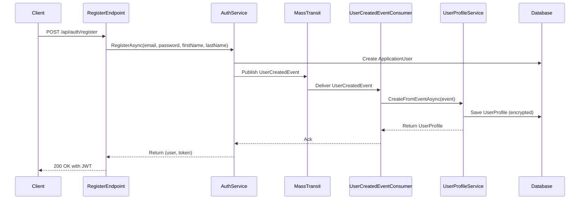

# Event Flow - User Registration to UserProfile Creation

## Sequence Diagram



## Components

| Component | Description |
|-----------|-------------|
| RegisterEndpoint | FastEndpoints endpoint handling registration |
| AuthService | Creates user and publishes domain event |
| MassTransit | Message broker for event delivery |
| UserCreatedEventConsumer | Handles UserCreatedEvent |
| UserProfileService | Creates UserProfile with PII encryption |
| Database | PostgreSQL database |

## Event Details

### UserCreatedEvent
```csharp
public record UserCreatedEvent
{
    public Guid EventId { get; init; } = Guid.NewGuid();
    public DateTime OccurredAt { get; init; } = DateTime.UtcNow;
    public string UserId { get; init; } = string.Empty;
    public string Email { get; init; } = string.Empty;
    public string FirstName { get; init; } = string.Empty;
    public string LastName { get; init; } = string.Empty;
}
```

### PII Encryption
The UserProfile's FirstName and LastName are encrypted using ASP.NET Core DataProtection before being stored in the database. This happens automatically via EF Core ValueConverter.
